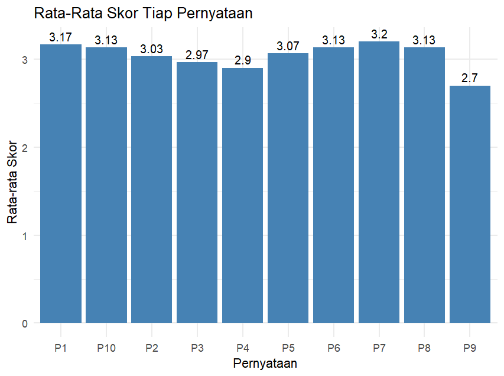
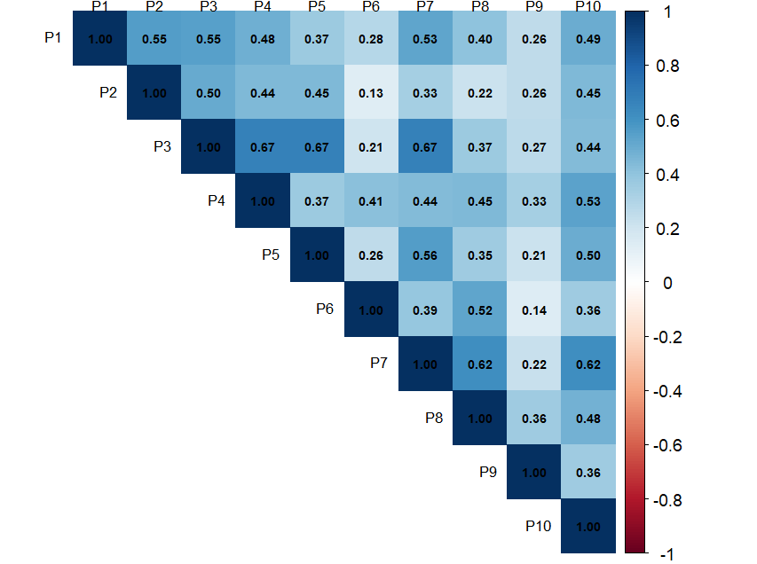

# Analisis Manajemen Waktu Belajar Mahasiswa Program Studi Statistika Universitas Mataram Menggunakan Metode Two-Stage Cluster Sampling


---

## 📖Deskripsi Proyek

Repository ini memuat seluruh tahapan penelitian mengenai manajemen waktu belajar mahasiswa Program Studi Statistika Universitas Mataram dengan menerapkan metode Two-Stage Cluster Sampling sebagai teknik pengambilan sampel. Penelitian dilakukan berdasarkan data hasil penyebaran kuesioner untuk memperoleh gambaran mengenai tingkat manajemen waktu belajar mahasiswa serta menghasilkan estimasi yang dapat mewakili populasi.

Proses analisis dilakukan menggunakan bahasa pemrograman R, dimulai dari pengolahan dan pemeriksaan kualitas data, pembentukan variabel penelitian, pengujian validitas dan reliabilitas instrumen, analisis statistika deskriptif, visualisasi data, perhitungan bobot sampel, hingga analisis survei melalui estimasi Weighted Mean, Standard Error (SE), Confidence Interval (CI), Design Effect (DEFF), dan Relative Standard Error (RSE).

Repository ini disusun sebagai dokumentasi penelitian yang terstruktur sehingga setiap tahapan analisis dapat dipelajari, direplikasi, dan dijadikan referensi dalam penerapan metode survei menggunakan Two-Stage Cluster Sampling.

---

## 📂Struktur Repository

```text
Analisis-Manajemen-Waktu-Belajar/
├── README.md
├── Executive_Summary.pdf
├── data/
│   ├── Data_Analisis_Manajemen_Waktu.xlsx
│   └── Randomisasi_Analisis_Manajemen_Waktu.xlsx
├── script/
│   └── Analisis_Manajemen_Waktu.R
└── output gambar/
    ├── Bar_Chart.png
    └── Korelasi.png
```

Keterangan struktur repository:

| Folder/File | Keterangan |
|-------------|------------|
| README.md | Dokumentasi lengkap penelitian, mulai dari metodologi, langkah analisis, hasil, hingga kesimpulan penelitian. |
| Executive_Summary.pdf | Ringkasan eksekutif penelitian yang memuat tujuan, metode, hasil utama, dan rekomendasi penelitian. |
| data | Berisi data penelitian yang digunakan dalam analisis, meliputi data hasil kuesioner dan hasil randomisasi sampel. |
| script | Berisi script R yang digunakan untuk seluruh proses analisis data, mulai dari pemeriksaan data, uji validitas, uji reliabilitas, analisis statistika deskriptif, visualisasi, pembobotan, hingga analisis survei. |
| output gambar | Berisi hasil visualisasi analisis berupa bar chart rata-rata skor setiap pernyataan dan heatmap korelasi antar item. |

---

## 📑 Daftar Isi

- [📖 Deskripsi Proyek](#-deskripsi-proyek)
- [📂 Struktur Repository](#-struktur-repository)
- [📚 Latar Belakang](#-latar-belakang)
- [🎯 Tujuan Penelitian](#-tujuan-penelitian)
- [🔬 Metodologi Penelitian](#-metodologi-penelitian)
- [🔄 Alur Analisis](#-alur-analisis)
- [⚙️ Langkah Analisis](#️-langkah-analisis)
- [📊 Hasil dan Pembahasan](#-hasil-dan-pembahasan)
- [✅ Kesimpulan](#-kesimpulan)
- [💡 Rekomendasi](#-rekomendasi)
- [📚 Referensi](#-referensi)
- [🔗 Link Kuesioner](#-link-kuesioner)

---

## 📚Latar Belakang

Manajemen waktu merupakan kemampuan seseorang dalam mengatur dan memanfaatkan waktu secara efektif untuk menyelesaikan berbagai aktivitas. Bagi mahasiswa, manajemen waktu belajar menjadi salah satu faktor penting yang dapat mendukung keberhasilan akademik. Kemampuan dalam mengatur jadwal belajar, menyelesaikan tugas tepat waktu, serta menyeimbangkan kegiatan akademik dan nonakademik dapat meningkatkan produktivitas dan efektivitas proses belajar.

Mahasiswa Program Studi Statistika Universitas Mataram memiliki berbagai aktivitas yang harus dijalankan, seperti mengikuti perkuliahan, mengerjakan tugas, praktikum, penelitian, organisasi, maupun kegiatan lainnya. Padatnya aktivitas tersebut menyebabkan setiap mahasiswa memiliki cara yang berbeda dalam mengatur waktu belajarnya. Oleh karena itu, diperlukan suatu penelitian untuk mengetahui bagaimana manajemen waktu belajar mahasiswa sehingga dapat memberikan gambaran mengenai kebiasaan belajar yang dimiliki.

Penelitian ini menggunakan metode Two-Stage Cluster Sampling sebagai teknik pengambilan sampel. Data diperoleh melalui penyebaran kuesioner kepada mahasiswa Program Studi Statistika Universitas Mataram. Hasil penelitian diharapkan dapat memberikan informasi mengenai karakteristik manajemen waktu belajar mahasiswa serta menjadi bahan evaluasi untuk meningkatkan efektivitas proses pembelajaran.

---

## 🎯Tujuan Penelitian

Penelitian ini bertujuan untuk:

- Mendeskripsikan tingkat manajemen waktu belajar mahasiswa Program Studi Statistika Universitas Mataram.
- Menguji validitas dan reliabilitas instrumen penelitian.
- Menerapkan metode Two-Stage Cluster Sampling dalam proses pengambilan sampel.
- Menghitung bobot sampel berdasarkan peluang pemilihan pada setiap tahap sampling.
- Mengestimasi rata-rata skor manajemen waktu belajar menggunakan analisis survei.
- Mengevaluasi kualitas hasil estimasi melalui Standard Error (SE), Confidence Interval (CI), Design Effect (DEFF), dan Relative Standard Error (RSE).

---

## 🔬Metodologi Penelitian

Metodologi penelitian menjelaskan pendekatan yang digunakan, teknik pengambilan sampel, instrumen penelitian, teknik pengumpulan data, serta tahapan analisis yang dilakukan untuk memperoleh hasil penelitian.

### Jenis Penelitian

Penelitian ini merupakan penelitian kuantitatif dengan metode survei. Data dikumpulkan melalui penyebaran kuesioner kepada mahasiswa Program Studi Statistika Universitas Mataram untuk memperoleh informasi mengenai manajemen waktu belajar mahasiswa.

### Populasi dan Sampel

Populasi dalam penelitian ini adalah seluruh mahasiswa aktif Program Studi Statistika Universitas Mataram.

Teknik pengambilan sampel menggunakan metode Two-Stage Cluster Sampling. Pada tahap pertama dilakukan pemilihan klaster menggunakan Simple Random Sampling (SRS). Klaster yang digunakan adalah kelas mahasiswa pada masing-masing angkatan sehingga terdapat enam klaster. Proses pemilihan klaster dilakukan secara acak menggunakan fungsi RAND pada Microsoft Excel hingga diperoleh dua klaster terpilih.

Selanjutnya, pada tahap kedua dilakukan pemilihan responden dari setiap klaster yang terpilih hingga diperoleh jumlah sampel penelitian.

### Instrumen Penelitian

Instrumen penelitian berupa kuesioner mengenai manajemen waktu belajar mahasiswa yang terdiri atas 15 butir pernyataan menggunakan Skala Likert 4 poin.

| Pilihan Jawaban | Skor |
|-----------------|:----:|
| Sangat Tidak Setuju (STS) | 1 |
| Tidak Setuju (TS) | 2 |
| Setuju (S) | 3 |
| Sangat Setuju (SS) | 4 |

### Variabel Penelitian

| Kode | Pernyataan |
|------|------------|
| P1 | Saya membuat jadwal belajar untuk membantu mengatur waktu belajar saya. |
| P2 | Saya belajar sesuai dengan jadwal yang telah saya rencanakan. |
| P3 | Saya memanfaatkan waktu luang untuk mengulang materi perkuliahan. |
| P4 | Saya menghindari menunda kegiatan belajar yang telah direncanakan. |
| P5 | Saya mengurangi penggunaan media sosial saat waktu belajar berlangsung. |
| P6 | Saya dapat berkonsentrasi dengan baik selama waktu belajar yang telah ditentukan. |
| P7 | Saya menggunakan waktu belajar secara efektif untuk memahami materi perkuliahan. |
| P8 | Saya menyelesaikan target belajar yang telah saya tetapkan. |
| P9 | Saya mengevaluasi penggunaan waktu belajar saya secara berkala. |
| P10 | Secara keseluruhan, saya merasa mampu mengelola waktu belajar dengan baik. |

### Teknik Pengumpulan Data

Data dikumpulkan melalui penyebaran kuesioner kepada responden yang terpilih sebagai sampel penelitian. Sebelum digunakan dalam penelitian utama, instrumen terlebih dahulu diuji validitas dan reliabilitas menggunakan responden di luar sampel penelitian.

---

## 🔄Alur Analisis
Analisis dilakukan menggunakan perangkat lunak R melalui tahapan:

1. Import data hasil kuesioner.
2. Pengolahan data (data cleaning).
3. Menyiapkan variabel penelitian.
4. Uji validitas instrumen.
5. Uji reliabilitas instrumen.
6. Analisis statistika deskriptif.
7. Visualisasi data.
8. Pembobotan menggunakan metode Two-Stage Cluster Sampling.
9. Analisis survei menggunakan package `survey`, yang meliputi perhitungan Weighted Mean, Confidence Interval (CI), Design Effect (DEFF), dan Relative Standard Error (RSE).
    
---

## ⚙️Langkah Analisis

### 1. Import Data

Data hasil kuesioner diimpor ke dalam R untuk dilakukan proses analisis.

```r
library(readxl)

data <- read_excel("Data_Manajemen_Waktu.xlsx")

head(data)
str(data)
summary(data)
```

### 2. Pengolahan Data

Tahap ini dilakukan untuk memastikan data siap dianalisis.

```r
# Mengecek missing value
colSums(is.na(data))

# Menghapus missing value
data <- na.omit(data)

# Outlier
boxplot.stats(data$Skor_Total)$out
```

### 3. Menyiapkan Variabel Penelitian

Variabel penelitian dipilih dari kolom H sampai V kemudian diberi nama P1–P15 agar lebih mudah dianalisis.

```r
item <- data %>%
  select(
    P1 = `Saya membuat jadwal belajar untuk membantu mengatur waktu belajar saya.`,
    P2 = `Saya belajar sesuai dengan jadwal yang telah saya rencanakan.`,
    P3 = `Saya memanfaatkan waktu luang untuk mengulang materi perkuliahan.`,
    P4 = `Saya menghindari menunda kegiatan belajar yang telah direncanakan.`,
    P5 = `Saya mengurangi penggunaan media sosial saat waktu belajar berlangsung.`,
    P6 = `Saya dapat berkonsentrasi dengan baik selama waktu belajar yang telah ditentukan.`,
    P7 = `Saya menggunakan waktu belajar secara efektif untuk memahami materi perkuliahan.`,
    P8 = `Saya menyelesaikan target belajar yang telah saya tetapkan.`,
    P9 = `Saya mengevaluasi penggunaan waktu belajar saya secara berkala.`,
    P10 = `Secara keseluruhan, saya merasa mampu mengelola waktu belajar dengan baik.`
  )

# Membuat skor total
data$Skor_Total <- rowSums(item)
```

### 4. Uji Validitas

Uji validitas dilakukan menggunakan Corrected Item-Total Correlation.

```r
library(psych)

hasil_validitas <- alpha(item)

hasil_validitas$item.stats
```

### 5. Uji Reliabilitas

Uji reliabilitas dilakukan menggunakan Cronbach's Alpha.

```r
hasil_reliabilitas <- alpha(item)

hasil_reliabilitas$total

data$Skor_Total <- rowSums(item)
```

### 6. Analisis Statistika Deskriptif

Analisis deskriptif dilakukan untuk mengetahui karakteristik responden dan gambaran skor manajemen waktu belajar.

```r
summary(data$Skor_Total)

mean(data$Skor_Total)
median(data$Skor_Total)
sd(data$Skor_Total)
min(data$Skor_Total)
max(data$Skor_Total)

table(data$Angkatan)
table(data$Semester)
table(data$`Jenis Kelamin`)

prop.table(table(data$`Jenis Kelamin`)) * 100
```

### 7. Visualisasi Data

Visualisasi data dilakukan untuk memberikan gambaran mengenai rata-rata skor setiap pernyataan serta hubungan antarbutir pernyataan pada kuesioner manajemen waktu belajar.

```r
library(ggplot2)
library(corrplot)

# Bar Chart Rata-rata Tiap Pernyataan

mean_item <- colMeans(item)

mean_df <- data.frame(
  Variabel = names(mean_item),
  Rata_rata = mean_item
)

ggplot(mean_df, aes(x = Variabel, y = Rata_rata)) +
  geom_col(fill = "steelblue") +
  geom_text(aes(label = round(Rata_rata, 2)),
            vjust = -0.4,
            size = 3.5) +
  labs(
    title = "Rata-rata Skor Tiap Pernyataan",
    x = "Pernyataan",
    y = "Rata-rata Skor"
  ) +
  theme_minimal()

# Heatmap Korelasi Antar Pernyataan

cor_item <- cor(item)

corrplot(
  cor_item,
  method = "color",
  type = "upper",
  tl.col = "black",
  tl.srt = 45,
  addCoef.col = "black",
  number.cex = 0.6
)
```

### 8. Pembobotan Two-Stage Cluster Sampling

Pembobotan dilakukan berdasarkan peluang pemilihan responden pada setiap tahap sampling.

```r
# Tahap pertama
M <- 6
m <- 2

P1 <- m/M

# Tahap kedua
N2024 <- 26
N2025 <- 32

n2024 <- 13
n2025 <- 17

P2_2024 <- n2024/N2024
P2_2025 <- n2025/N2025

# Bobot
Weight2024 <- 1/(P1*P2_2024)
Weight2025 <- 1/(P1*P2_2025)

# Menambahkan bobot ke data
data$Weight <- ifelse(
  data$Angkatan == 2024,
  Weight2024,
  Weight2025
)
```

### 9. Analisis Survey

Analisis data dilakukan menggunakan package **survey**.

```r
library(survey)

design <- svydesign(
  ids = ~Angkatan,
  weights = ~Weight,
  data = data
)

# Weighted Mean
svymean(~Skor_Total, design)

# Confidence Interval 95%
confint(svymean(~Skor_Total, design))

# Standard Error
SE(svymean(~Skor_Total, design))

# Design Effect
svymean(~Skor_Total, design, deff = TRUE)

# Relative Standard Error
hasil <- svymean(~Skor_Total, design)

SE(hasil) / coef(hasil) * 100
```
---

## 📊HASIL DAN PEMBAHASAN

### 1. Import Data
#### Head Data
Bagian ini menampilkan enam data pertama dari dataset untuk memberikan gambaran awal mengenai struktur data yang digunakan dalam penelitian.

| Timestamp | Nama | Program Studi | Kelas | Angkatan | Semester | Jenis Kelamin |
|----------|------|--------------|-------|----------|----------|----------------|
| 2026-06-18 21:25:31 | Tabrani Ali | Statistika | A | 2025 | 2 | Laki-Laki |
| 2026-06-18 21:31:47 | Ni Kadek Mintya Yulantini | Statistika | A | 2025 | 2 | Perempuan |
| 2026-06-18 21:38:18 | Nurlinda suryani | Statistika | A | 2024 | 4 | Perempuan |
| 2026-06-18 21:38:30 | aura alifa | Statistika | A | 2024 | 4 | Perempuan |
| 2026-06-18 22:14:15 | Era Faz... | Statistika | A | 2024 | 4 | Perempuan |
| 2026-06-18 23:45:05 | Meylisa... | Statistika | A | 2024 | 4 | Perempuan |

Berdasarkan data awal tersebut, terlihat bahwa responden terdiri dari mahasiswa Program Studi Statistika dengan variasi angkatan 2024 dan 2025. Data juga menunjukkan bahwa responden berasal dari satu kelas utama yaitu kelas A dengan perbedaan pada semester aktif.

#### Struktur Data

Struktur data digunakan untuk mengetahui tipe variabel yang terdapat dalam dataset penelitian.

| Variabel | Tipe Data | Keterangan |
|----------|----------|-------------|
| Timestamp | POSIXct | Waktu pengisian kuesioner |
| Nama | character | Nama responden |
| Program Studi | character | Program studi responden |
| Kelas | character | Kelas responden |
| Angkatan | numeric | Tahun angkatan |
| Semester | numeric | Semester aktif |
| Jenis Kelamin | character | Gender responden |
| Item 1–10 | numeric | Skala Likert 1–4 |

Hasil struktur data menunjukkan bahwa variabel penelitian terdiri dari kombinasi data kategorik dan numerik. Variabel item kuesioner (P1–P10) bertipe numerik yang sesuai untuk analisis statistik lanjutan seperti uji validitas, reliabilitas, dan analisis deskriptif.

#### Statistik Deskriptif Item Kuesioner 

Statistik deskriptif digunakan untuk menggambarkan pola jawaban responden terhadap setiap indikator manajemen waktu belajar.

| Item | Min | Q1 | Median | Mean | Q3 | Max |
|------|-----|----|--------|------|----|-----|
| P1 | 2.00 | 3.00 | 3.00 | 3.167 | 3.00 | 4.00 |
| P2 | 1.00 | 3.00 | 3.00 | 3.033 | 3.00 | 4.00 |
| P3 | 1.00 | 3.00 | 3.00 | 2.967 | 3.00 | 4.00 |
| P4 | 2.00 | 2.25 | 3.00 | 2.900 | 3.00 | 4.00 |
| P5 | 2.00 | 3.00 | 3.00 | 3.067 | 4.00 | 4.00 |
| P6 | 2.00 | 3.00 | 3.00 | 3.133 | 3.00 | 4.00 |
| P7 | 2.00 | 3.00 | 3.00 | 3.200 | 3.75 | 4.00 |
| P8 | 2.00 | 3.00 | 3.00 | 3.133 | 3.75 | 4.00 |
| P9 | 1.00 | 2.00 | 3.00 | 2.700 | 3.00 | 4.00 |
| P10 | 2.00 | 3.00 | 3.00 | 3.133 | 3.75 | 4.00 |

Berdasarkan hasil statistik deskriptif, nilai rata-rata setiap item kuesioner berada pada rentang 2.700 hingga 3.200. Hal ini menunjukkan bahwa secara umum responden cenderung memberikan jawaban pada kategori “setuju”, yang mengindikasikan bahwa mahasiswa memiliki kecenderungan cukup baik dalam mengelola waktu belajar mereka. Nilai median pada sebagian besar item berada pada angka 3, yang menunjukkan bahwa jawaban responden terkonsentrasi pada kategori sedang hingga tinggi. Hal ini mengindikasikan bahwa distribusi jawaban relatif stabil dan tidak menunjukkan penyebaran yang ekstrem pada sebagian besar item. Nilai minimum yang berada pada rentang 1 hingga 2 menunjukkan bahwa terdapat sebagian kecil responden dengan tingkat manajemen waktu belajar yang masih rendah. Namun demikian, nilai tersebut tidak mendominasi keseluruhan data. Sebaliknya, nilai maksimum yang mencapai 4 pada hampir seluruh item menunjukkan bahwa terdapat responden yang memiliki kemampuan manajemen waktu belajar yang sangat baik. Secara keseluruhan, hasil ini menunjukkan bahwa indikator manajemen waktu belajar mahasiswa Program Studi Statistika Universitas Mataram berada pada kategori cukup baik, dengan kecenderungan jawaban responden berada pada tingkat “setuju”.

### 2. Pengolahan Data (Data Cleaning)

Tahap pengolahan data dilakukan untuk memastikan bahwa data yang digunakan telah memenuhi kualitas yang diperlukan sebelum memasuki tahap analisis. Pemeriksaan meliputi jumlah responden, keberadaan *missing value*, data duplikat, dan *outlier*.

| Pemeriksaan | Hasil |
|--------------|:----:|
| Jumlah Responden | 30 |
| Missing Value | 0 |
| Data Duplikat | 0 |
| Outlier (Metode IQR) | 0 |
| Status Data | Data siap dianalisis |

Berdasarkan hasil pengolahan data, diketahui bahwa data penelitian terdiri atas 30 responden. Hasil pemeriksaan menunjukkan bahwa tidak terdapat *missing value*, data duplikat, maupun *outlier* berdasarkan metode *Interquartile Range* (IQR). Dengan demikian, data telah memenuhi kriteria kualitas yang baik sehingga dapat digunakan pada tahap analisis selanjutnya tanpa memerlukan proses pembersihan atau perbaikan data tambahan.

## 3. Uji Validitas

Uji validitas dilakukan untuk mengetahui apakah setiap butir pernyataan pada kuesioner telah mampu mengukur variabel manajemen waktu belajar mahasiswa. Pengujian menggunakan metode *Corrected Item-Total Correlation* (r.drop). Suatu item dinyatakan valid apabila memiliki nilai r.drop ≥ 0,300.

```text
                Σ(Xi − X̄i)(Ti − T̄i)
r_it = -------------------------------------
           √[Σ(Xi − X̄i)² × Σ(Ti − T̄i)²]
```

Keterangan:

- r_it : Corrected Item-Total Correlation pada item ke-i.
- Xi : Skor responden pada item ke-i.
- X̄i : Rata-rata skor pada item ke-i.
- Ti : Skor total responden tanpa memasukkan skor item ke-i.
- T̄i : Rata-rata skor total tanpa memasukkan item ke-i.

| Item | r.drop | Keterangan |
|:----:|-------:|:----------:|
| P1 | 0.633 | Valid |
| P2 | 0.536 | Valid |
| P3 | 0.711 | Valid |
| P4 | 0.677 | Valid |
| P5 | 0.604 | Valid |
| P6 | 0.412 | Valid |
| P7 | 0.711 | Valid |
| P8 | 0.599 | Valid |
| P9 | 0.375 | Valid |
| P10 | 0.685 | Valid |

Berdasarkan Tabel di atas, seluruh butir pernyataan memiliki nilai Corrected Item-Total Correlation (r.drop) lebih besar dari 0,300, yaitu berkisar antara 0,375 hingga 0,711. Hasil tersebut menunjukkan bahwa seluruh item telah memenuhi kriteria validitas sehingga mampu mengukur variabel manajemen waktu belajar mahasiswa dengan baik. Nilai r.drop tertinggi terdapat pada item P3 dan P7, yaitu sebesar 0,711, yang menunjukkan bahwa kedua item memiliki hubungan paling kuat dengan skor total instrumen. Sementara itu, nilai r.drop terendah terdapat pada item P9, yaitu sebesar 0,375. Meskipun merupakan nilai terendah, nilai tersebut masih berada di atas batas minimum yang ditetapkan sehingga item tersebut tetap dinyatakan valid. Secara keseluruhan, seluruh 10 item pernyataan dinyatakan valid dan layak digunakan pada tahap uji reliabilitas serta analisis selanjutnya tanpa perlu mengeliminasi satu pun butir pernyataan.

---

## 4. Uji Reliabilitas

Uji reliabilitas dilakukan untuk mengetahui tingkat konsistensi instrumen penelitian. Pengujian dilakukan menggunakan metode *Cronbach's Alpha*. Instrumen dinyatakan reliabel apabila memiliki nilai Cronbach's Alpha ≥ 0,700.

```text
             k
α = ---------------- × [1 − (ΣSi² / ST²)]
          (k − 1)
```

Keterangan:

- α : Koefisien Cronbach's Alpha.
- k : Jumlah item pernyataan.
- Si² : Varians masing-masing item.
- ST² : Varians skor total.

| Parameter | Nilai |
|:-------------------------------|------:|
| Cronbach's Alpha (raw_alpha) | 0.868 |
| Standardized Alpha (std.alpha) | 0.874 |
| G6(smc) | 0.904 |
| Average Inter-Item Correlation | 0.410 |
| Signal-to-Noise Ratio (S/N) | 6.956 |
| Standard Error (ase) | 0.036 |
| Mean | 3.043 |
| Standard Deviation | 0.460 |
| Median Inter-Item Correlation | 0.413 |

Berdasarkan Tabel di atas, diperoleh nilai *Cronbach's Alpha* sebesar 0.868, lebih besar dari batas minimum 0.700. Hasil tersebut menunjukkan bahwa instrumen penelitian memiliki tingkat reliabilitas yang tinggi sehingga mampu memberikan hasil pengukuran yang konsisten. Nilai *Standardized Alpha* sebesar 0.874 juga menunjukkan konsistensi internal yang sangat baik setelah dilakukan standardisasi data. Selain itu, nilai *Average Inter-Item Correlation* sebesar *0.410* mengindikasikan bahwa antarbutir pernyataan memiliki hubungan yang cukup baik dalam mengukur konstruk yang sama, yaitu manajemen waktu belajar mahasiswa. Secara keseluruhan, hasil uji reliabilitas menunjukkan bahwa seluruh 10 item pernyataan memiliki tingkat konsistensi internal yang baik sehingga instrumen penelitian dinyatakan *reliabel* dan layak digunakan pada tahap analisis statistika deskriptif, pembobotan *Two-Stage Cluster Sampling*, serta analisis survei.

---

## 5. Statistik Deskriptif

### Analisis Statistika Deskriptif

Analisis statistika deskriptif dilakukan untuk memberikan gambaran umum mengenai skor manajemen waktu belajar mahasiswa serta karakteristik responden berdasarkan angkatan, semester, dan jenis kelamin.

#### Statistik Deskriptif Skor Manajemen Waktu Belajar

| Statistik | Nilai |
|:----------------------|------:|
| Minimum | 21.00 |
| Kuartil 1 (Q1) | 28.00 |
| Median | 30.00 |
| Mean | 30.43 |
| Kuartil 3 (Q3) | 33.75 |
| Maksimum | 39.00 |
| Standar Deviasi | 4.60 |

Berdasarkan tabel di atas, diperoleh rata-rata skor manajemen waktu belajar mahasiswa sebesar 30,43 dengan nilai median 30,00. Skor terendah yang diperoleh responden adalah 21, sedangkan skor tertinggi adalah 39. Nilai standar deviasi sebesar 4,60 menunjukkan bahwa penyebaran skor responden relatif tidak terlalu besar, sehingga sebagian besar nilai berada di sekitar rata-rata.

#### Distribusi Responden Berdasarkan Angkatan

| Angkatan | Jumlah Responden | Persentase (%) |
|:---------:|-----------------:|---------------:|
| 2024 | 13 | 43.33 |
| 2025 | 17 | 56.67 |
| **Total** | **30** | **100.00** |

Berdasarkan tabel di atas, sebagian besar responden berasal dari angkatan 2025 sebanyak 17 orang (56,67%), sedangkan responden dari angkatan 2024 berjumlah 13 orang (43,33%).

#### Distribusi Responden Berdasarkan Semester

| Semester | Jumlah Responden | Persentase (%) |
|:---------:|-----------------:|---------------:|
| 2 | 17 | 56.67 |
| 4 | 13 | 43.33 |
| **Total** | **30** | **100.00** |

Berdasarkan tabel di atas, responden didominasi oleh mahasiswa semester 2 sebanyak 17 orang (56,67%), sedangkan mahasiswa semester 4 berjumlah 13 orang (43,33%).


#### Distribusi Responden Berdasarkan Jenis Kelamin

| Jenis Kelamin | Jumlah Responden | Persentase (%) |
|:--------------|-----------------:|---------------:|
| Laki-Laki | 3 | 10.00 |
| Perempuan | 27 | 90.00 |
| **Total** | **30** | **100.00** |

Berdasarkan tabel di atas, mayoritas responden berjenis kelamin perempuan, yaitu sebanyak 27 orang (90,00%), sedangkan responden laki-laki berjumlah 3 orang (10,00%). Hal ini menunjukkan bahwa karakteristik responden dalam penelitian ini didominasi oleh mahasiswa perempuan.

---

## 6. Visualisasi Data

### Bar Chart Rata-rata Skor Tiap Pernyataan

<p align="center">
  
</p>

Berdasarkan hasil visualisasi, rata-rata skor setiap pernyataan berada pada rentang 2,70 hingga 3,20 dari skala 1–4. Hal ini menunjukkan bahwa secara umum responden cenderung memberikan jawaban pada kategori "Setuju" terhadap seluruh indikator manajemen waktu belajar. Nilai rata-rata tertinggi terdapat pada pernyataan P7 sebesar 3,20, yang menunjukkan bahwa responden cukup mampu menyelesaikan target belajar yang telah ditetapkan. Sementara itu, nilai rata-rata terendah terdapat pada pernyataan P9 sebesar 2,70, yang mengindikasikan bahwa kemampuan membagi waktu antara belajar, organisasi, dan kegiatan pribadi masih menjadi aspek yang relatif lebih rendah dibandingkan indikator lainnya. Secara keseluruhan, hasil ini menunjukkan bahwa mahasiswa Program Studi Statistika Universitas Mataram memiliki tingkat manajemen waktu belajar yang tergolong cukup baik.

### Heatmap Korelasi Antar Item

<p align="center">
  
</p>

Berdasarkan heatmap korelasi, seluruh item kuesioner memiliki hubungan yang bernilai positif dengan koefisien korelasi berkisar antara 0,13 hingga 0,67. Korelasi tertinggi terdapat pada pasangan item P3–P4 dan P3–P7 dengan nilai sebesar 0,67, yang menunjukkan hubungan cukup kuat antar kedua indikator tersebut. Sebaliknya, korelasi terendah terdapat pada pasangan item P2–P6 sebesar 0,13, yang menunjukkan hubungan yang relatif lemah. Secara keseluruhan, tidak ditemukan korelasi negatif antar item, sehingga seluruh indikator memiliki arah hubungan yang sejalan dalam mengukur manajemen waktu belajar mahasiswa. Pola korelasi yang didominasi oleh hubungan positif sedang hingga kuat juga mendukung konsistensi instrumen dalam mengukur konstruk yang sama.

---

## 7. Pembobotan Two-Stage Cluster Sampling

Pembobotan dilakukan untuk memperoleh bobot setiap responden berdasarkan peluang terpilihnya sampel pada metode *Two-Stage Cluster Sampling*. Bobot dihitung menggunakan peluang pemilihan pada tahap pertama dan tahap kedua.

Peluang terpilihnya suatu responden dihitung menggunakan persamaan berikut.

```text
P = P₁ × P₂
```

dengan:

- P₁ : Peluang pemilihan klaster pada tahap pertama.
- P₂ : Peluang pemilihan responden pada tahap kedua.

Bobot setiap responden dihitung menggunakan persamaan berikut.

```text
W = 1 / P
```

### Tahap Pertama

Diketahui:

- Jumlah klaster populasi (M) = 6
- Jumlah klaster yang dipilih (m) = 2

Sehingga peluang pemilihan klaster adalah

```text
P₁ = m / M
   = 2 / 6
   = 0,3333
```

### Tahap Kedua

#### Angkatan 2024

Peluang pemilihan responden pada angkatan 2024 adalah

```text
P₂ = 13 / 26
   = 0,5000
```

Sehingga bobot responden angkatan 2024 adalah

```text
W₂₀₂₄ = 1 / (0,3333 × 0,5000)
      = 6,0000
```

#### Angkatan 2025

Peluang pemilihan responden pada angkatan 2025 adalah

```text
P₂ = 17 / 32
   = 0,5313
```

Sehingga bobot responden angkatan 2025 adalah

```text
W₂₀₂₅ = 1 / (0,3333 × 0,5313)
      = 5,6471
```

### Hasil Perhitungan Bobot

| Angkatan | Populasi (N) | Sampel (n) | Peluang Tahap 2 | Bobot |
|:---------:|-------------:|-----------:|----------------:|-------:|
| 2024 | 26 | 13 | 0.5000 | 6.0000 |
| 2025 | 32 | 17 | 0.5313 | 5.6471 |

Berdasarkan hasil perhitungan diperoleh bobot sebesar 6,0000 untuk responden angkatan 2024 dan 5,6471 untuk responden angkatan 2025. Perbedaan bobot tersebut terjadi karena peluang terpilihnya responden pada masing-masing angkatan berbeda. Bobot tersebut selanjutnya digunakan dalam analisis survei agar hasil estimasi yang diperoleh lebih representatif terhadap populasi penelitian.

---

## 8. Analisis Survey

Analisis survei dilakukan menggunakan package `survey` pada perangkat lunak R dengan memanfaatkan bobot hasil pembobotan *Two-Stage Cluster Sampling* yang telah diperoleh pada tahap sebelumnya. Analisis ini bertujuan untuk memperoleh estimasi rata-rata skor manajemen waktu belajar mahasiswa beserta ukuran ketelitian hasil estimasinya.


### Weighted Mean

Rata-rata tertimbang dihitung menggunakan persamaan berikut.

```text
          Σ(wiYi)
Ȳw = ----------------
            Σwi
```

Keterangan:

- Ȳw : Weighted Mean (rata-rata tertimbang)
- wi : Bobot responden ke-i
- Yi : Skor total responden ke-i

| Parameter | Nilai |
|:----------|------:|
| Weighted Mean | 30.398 |
| Standard Error | 1.184 |

Berdasarkan hasil analisis diperoleh nilai *Weighted Mean* sebesar 30,398. Nilai ini menunjukkan bahwa rata-rata skor manajemen waktu belajar mahasiswa Program Studi Statistika Universitas Mataram setelah memperhitungkan bobot sampling adalah sekitar 30,40. Dengan rentang skor total antara 10 hingga 40, hasil tersebut menunjukkan bahwa secara umum mahasiswa memiliki tingkat manajemen waktu belajar yang tergolong baik.

### Confidence Interval (95%)

Interval kepercayaan dihitung menggunakan persamaan berikut.

```text
CI = Ȳ ± Zα/2 × SE
```

Keterangan:

- CI : Confidence Interval
- Ȳ : Rata-rata estimasi
- Zα/2 : Nilai Z pada tingkat kepercayaan 95% (1,96)
- SE : Standard Error

| Batas Bawah | Batas Atas |
|------------:|-----------:|
| 28.077 | 32.718 |

Berdasarkan hasil analisis diperoleh interval kepercayaan 95% sebesar 28,077 hingga 32,718. Hal ini berarti bahwa dengan tingkat kepercayaan sebesar 95%, rata-rata skor manajemen waktu belajar mahasiswa pada populasi diperkirakan berada pada rentang tersebut. Rentang interval yang tidak terlalu lebar menunjukkan bahwa estimasi rata-rata yang diperoleh memiliki tingkat ketelitian yang cukup baik.

### Design Effect (DEFF)

Design Effect dihitung menggunakan persamaan berikut.

```text
             Var(design)
DEFF = -----------------------
              Var(SRS)
```

Keterangan:

- Var(design) : Varians berdasarkan desain sampling
- Var(SRS) : Varians berdasarkan Simple Random Sampling

| Parameter | Nilai |
|:----------|------:|
| Design Effect | 2.387 |

Berdasarkan hasil analisis diperoleh nilai *Design Effect* sebesar 2,387. Nilai ini menunjukkan bahwa varians estimasi menggunakan desain *Two-Stage Cluster Sampling* sekitar 2,39 kali lebih besar dibandingkan apabila menggunakan *Simple Random Sampling*. Kondisi tersebut merupakan hal yang umum pada metode cluster sampling karena responden dalam satu klaster cenderung memiliki karakteristik yang lebih mirip dibandingkan responden dari klaster yang berbeda.

### Relative Standard Error (RSE)

Relative Standard Error dihitung menggunakan persamaan berikut.

```text
          SE
RSE = -------- × 100%
          Ȳ
```

Keterangan:

- RSE : Relative Standard Error
- SE : Standard Error
- Ȳ : Rata-rata estimasi

| Parameter | Nilai |
|:----------|------:|
| Relative Standard Error | 3.895% |

Berdasarkan hasil analisis diperoleh nilai *Relative Standard Error* sebesar 3,895%. Nilai tersebut berada di bawah batas 5%, sehingga menunjukkan bahwa hasil estimasi memiliki tingkat presisi yang sangat baik. Dengan demikian, rata-rata skor manajemen waktu belajar yang diperoleh dapat dianggap cukup andal dan representatif dalam menggambarkan kondisi populasi mahasiswa Program Studi Statistika Universitas Mataram.

### Hasil Analisis Survey

| Parameter | Nilai | 
|:----------|------:|
| Weighted Mean | 30.398 | 
| Standard Error (SE) | 1.184 | 
| Confidence Interval (95%) | 28.077 – 32.718 |
| Design Effect (DEFF) | 2.387 |
| Relative Standard Error (RSE) | 3.895% | 

Berdasarkan hasil analisis kualitas estimasi, diperoleh nilai Weighted Mean sebesar 30,398 yang menunjukkan bahwa rata-rata skor manajemen waktu belajar mahasiswa setelah memperhitungkan bobot sampling berada pada angka tersebut. Nilai Standard Error sebesar 1,184 mengindikasikan bahwa tingkat kesalahan estimasi relatif kecil sehingga rata-rata yang diperoleh cukup stabil. Confidence Interval 95% berada pada rentang 28,077 hingga 32,718, yang berarti rata-rata skor manajemen waktu belajar mahasiswa pada populasi diperkirakan berada dalam interval tersebut dengan tingkat kepercayaan sebesar 95%. Nilai Design Effect (DEFF) sebesar 2,387 menunjukkan bahwa varians estimasi menggunakan metode Two-Stage Cluster Sampling sekitar 2,39 kali lebih besar dibandingkan apabila menggunakan Simple Random Sampling. Hal ini merupakan konsekuensi dari penggunaan desain cluster sampling, di mana responden dalam satu klaster cenderung memiliki karakteristik yang lebih serupa. Selain itu, nilai Relative Standard Error (RSE) sebesar 3,895% berada di bawah batas 5%, sehingga menunjukkan bahwa hasil estimasi memiliki tingkat presisi yang sangat baik. Dengan demikian, hasil analisis yang diperoleh dapat dianggap cukup andal dan representatif dalam menggambarkan kondisi manajemen waktu belajar mahasiswa Program Studi Statistika Universitas Mataram.

---

## ✅Kesimpulan

Berdasarkan hasil analisis yang telah dilakukan, diperoleh beberapa kesimpulan sebagai berikut.

1. Metode Two-Stage Cluster Sampling berhasil diterapkan untuk memilih sampel mahasiswa Program Studi Statistika Universitas Mataram melalui dua tahap, yaitu pemilihan klaster secara acak dan pemilihan responden pada klaster terpilih.

2. Hasil uji validitas menunjukkan bahwa seluruh 10 butir pernyataan memiliki nilai corrected item-total correlation (r.drop) lebih besar dari 0,300 sehingga seluruh item dinyatakan valid dan layak digunakan dalam penelitian.

3. Hasil uji reliabilitas menghasilkan nilai Cronbach's Alpha sebesar 0,868, yang menunjukkan bahwa instrumen penelitian memiliki konsistensi internal yang baik dan reliabel.

4. Hasil statistik deskriptif menunjukkan bahwa rata-rata skor manajemen waktu belajar mahasiswa berada pada kategori yang cukup baik. Hal ini mengindikasikan bahwa sebagian besar responden telah mampu mengatur waktu belajar secara efektif.

5. Hasil pembobotan menghasilkan bobot sebesar 6,000 untuk responden angkatan 2024 dan 5,647 untuk responden angkatan 2025. Perbedaan bobot tersebut disebabkan oleh perbedaan peluang terpilihnya responden pada masing-masing angkatan.

6. Hasil analisis survei menunjukkan Weighted Mean sebesar 30,398 dengan Confidence Interval 95% sebesar 28,077–32,718. Nilai Design Effect (DEFF) sebesar 2,387 menunjukkan bahwa varians estimasi lebih besar dibandingkan Simple Random Sampling sebagai konsekuensi penggunaan cluster sampling. Sementara itu, nilai Relative Standard Error (RSE) sebesar 3,895% berada di bawah batas 5%, sehingga hasil estimasi memiliki tingkat presisi yang sangat baik dan dapat dianggap representatif terhadap populasi.

Secara keseluruhan, penelitian ini menunjukkan bahwa metode Two-Stage Cluster Sampling dapat diterapkan dengan baik dalam pengambilan sampel mahasiswa Program Studi Statistika Universitas Mataram. Instrumen penelitian yang digunakan telah memenuhi kriteria valid dan reliabel, sehingga layak digunakan untuk mengukur manajemen waktu belajar mahasiswa. Hasil analisis menunjukkan bahwa rata-rata manajemen waktu belajar mahasiswa berada pada kategori yang cukup baik. Selain itu, hasil analisis kualitas estimasi menghasilkan nilai Relative Standard Error (RSE) sebesar 3,895%, yang menunjukkan bahwa estimasi yang diperoleh memiliki tingkat presisi yang sangat baik. Dengan demikian, hasil penelitian ini dapat dianggap representatif dalam menggambarkan kondisi manajemen waktu belajar mahasiswa Program Studi Statistika Universitas Mataram.

---

## 💡Rekomendasi

Berdasarkan hasil penelitian yang telah dilakukan, beberapa rekomendasi yang dapat diberikan adalah sebagai berikut.

1. Mahasiswa diharapkan dapat mempertahankan dan meningkatkan kemampuan dalam mengelola waktu belajar melalui penyusunan jadwal belajar, penentuan prioritas, serta mengurangi aktivitas yang dapat mengganggu proses belajar.

2. Program Studi Statistika Universitas Mataram dapat memanfaatkan hasil penelitian ini sebagai informasi awal dalam menyusun program atau kegiatan yang mendukung peningkatan kemampuan manajemen waktu belajar mahasiswa.

3. Penelitian selanjutnya disarankan menggunakan jumlah sampel yang lebih besar atau melibatkan program studi maupun fakultas lain agar hasil penelitian memiliki cakupan yang lebih luas dan dapat dibandingkan antar kelompok.

---

## 🔗Link Kuesioner

Kuesioner penelitian dapat diakses melalui tautan berikut:

https: https://forms.gle/LPYhPn3oLHUgjiNr8
